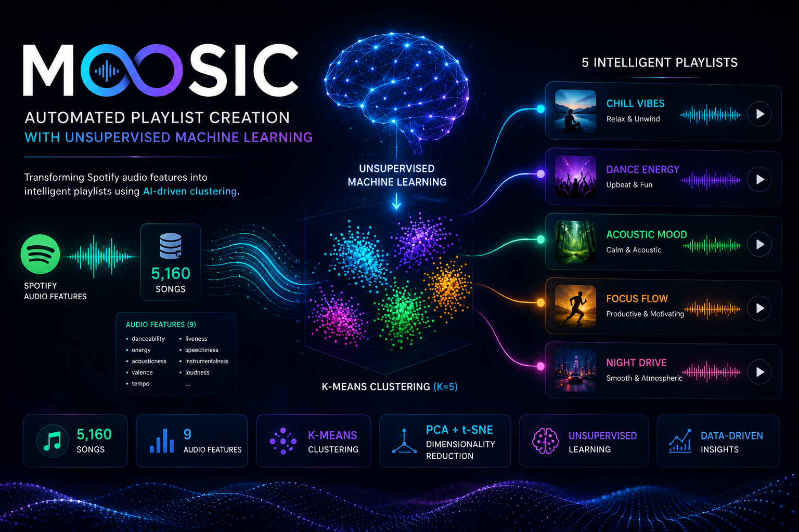
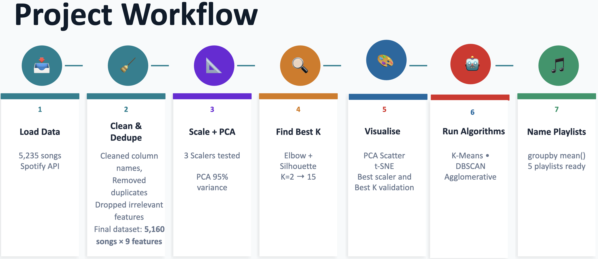
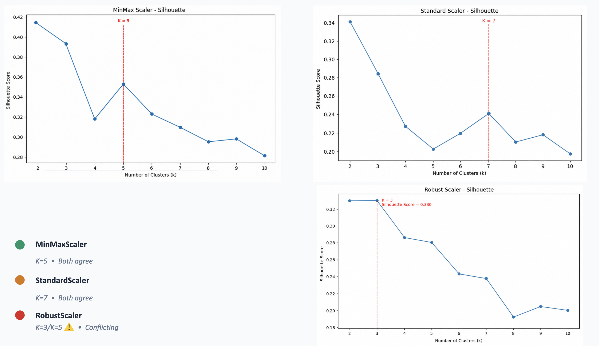
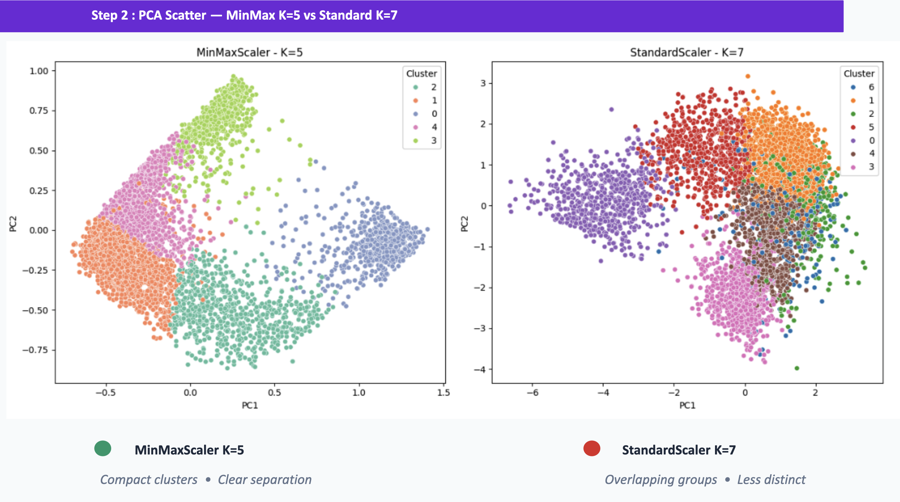
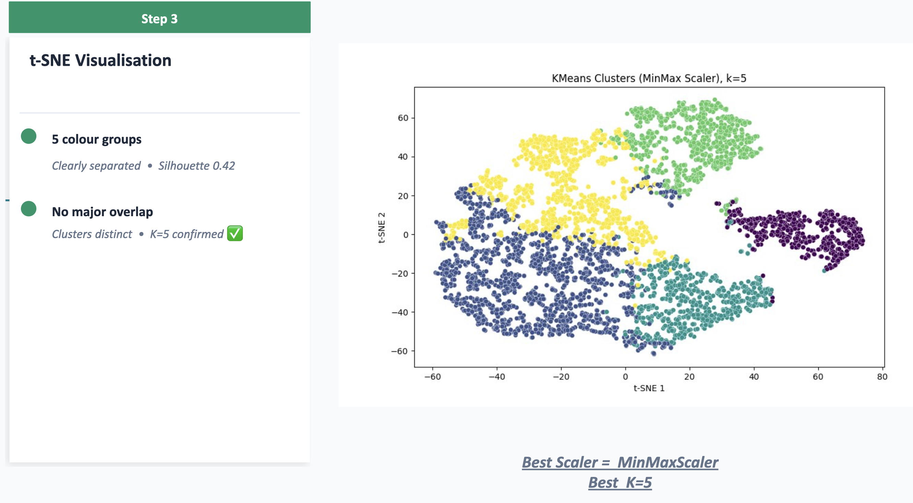
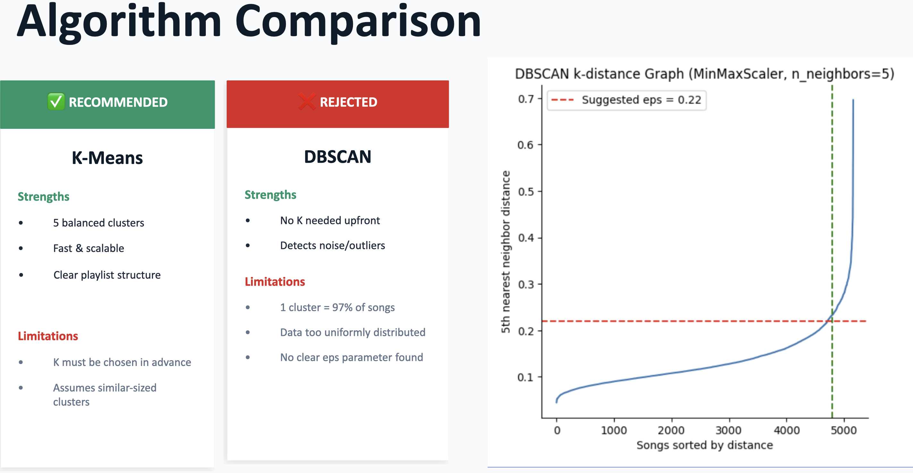
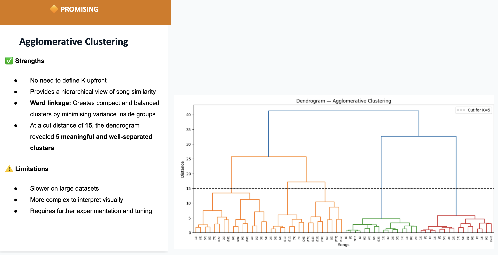
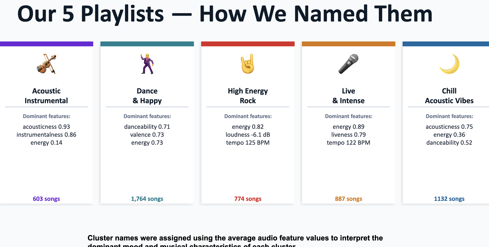

# 🎵 MOOSIC
## Automated Playlist Creation with Unsupervised Machine Learning



**MOOSIC** is an end-to-end Machine Learning project that transforms Spotify audio features into **intelligent, automatically generated playlists** using **Unsupervised Learning**.

Instead of relying on predefined genres, the system discovers hidden patterns in music by applying clustering algorithms and dimensionality reduction techniques, creating meaningful playlists directly from audio characteristics.

---

## 🚀 Project Overview

- 🎧 **Dataset:** 5,160 Spotify songs
- 📊 **Features:** 9 audio features (danceability, energy, acousticness, valence, tempo, loudness, etc.)
- 🤖 **Learning Type:** Unsupervised Machine Learning
- 🔍 **Algorithms:** K-Means, DBSCAN, Agglomerative Clustering
- 📉 **Dimensionality Reduction:** PCA & t-SNE
- ⚙️ **Preprocessing:** MinMaxScaler, StandardScaler, RobustScaler
- 🎯 **Final Result:** 5 automatically generated intelligent playlists

---

## 🛠️ Tech Stack

| Category | Technologies |
|----------|-------------|
| Programming | Python |
| Data Analysis | Pandas, NumPy |
| Data Visualization | Matplotlib, Seaborn |
| Machine Learning | Scikit-learn |
| Clustering | K-Means, DBSCAN, Agglomerative Clustering |
| Dimensionality Reduction | PCA, t-SNE |
| Notebook | Jupyter Notebook |
| Version Control | Git & GitHub |

---

## 📂 Project Workflow

The project follows a complete Machine Learning pipeline, from data preparation to playlist generation.



### Workflow Steps
1. Load Spotify audio dataset.
2. Clean and preprocess the data.
3. Scale features and apply PCA.
4. Determine the optimal number of clusters.
5. Visualize cluster structures.
6. Compare clustering algorithms.
7. Generate and interpret intelligent playlists.

---

## 📊 Selecting the Best Configuration

Different scaling techniques and cluster numbers were evaluated using the Elbow Method and Silhouette Score.

### Elbow Method


### Silhouette Analysis


**Final choice:**  
- ✅ MinMaxScaler
- ✅ K = 5 clusters

---

## 🔍 Cluster Validation

### PCA Projection
Comparison between MinMaxScaler and StandardScaler.



### t-SNE Visualization

The t-SNE projection confirms that the five clusters are visually distinct with limited overlap.



---

## 🤖 Algorithm Comparison

Different clustering algorithms were evaluated to determine the best fit for the dataset.

### K-Means vs DBSCAN



### Agglomerative Clustering



### Conclusion

| Algorithm | Result |
|------------|--------|
| K-Means | ✅ Selected (best balance between quality and scalability) |
| DBSCAN | ❌ Rejected (dataset too uniformly distributed) |
| Agglomerative Clustering | ✅ Useful for validation and hierarchy visualization |

---

## 🎶 Generated Intelligent Playlists

The final K-Means model automatically grouped songs into five meaningful playlists based on their average audio characteristics.



### Generated Playlists
- 🎻 Acoustic Instrumental
- 🕺 Dance & Happy
- 🤘 High Energy Rock
- 🎤 Live & Intense
- 🌙 Chill Acoustic Vibes

---

## 📈 Model Evaluation & Future Improvements

The clustering approach produced well-separated and interpretable groups while highlighting opportunities for future enhancement.


### Future Work
- Integrate genre and language metadata.
- Include lyrics sentiment analysis.
- Add user listening behavior.
- Build a feedback loop for personalized recommendations.
- Extend the system toward a hybrid recommendation engine.

---

## 🎼 Final Reflection

> **"Machine learning can scale playlist generation — but the human ear should always have the final say."**


This project demonstrates how Unsupervised Machine Learning can assist creative decision-making while preserving the importance of human interpretation and domain expertise.

---

## 📁 Repository Structure

```text
MOOSIC/
│
├── data/
├── images/
├── notebooks/
│   └── moosic_clustering.ipynb
├── requirements.txt
├── LICENSE
└── README.md
```

---

## ⚡ Installation

Clone the repository:

```bash
git clone https://github.com/YOUR-USERNAME/moosic-playlist-clustering.git
cd moosic-playlist-clustering
```

Install dependencies:

```bash
pip install -r requirements.txt
```

Launch Jupyter Notebook:

```bash
jupyter notebook
```

---

## 👩‍💻 About the Author

**Tatiana Tchouakam Chouacheu**  
*Data Science & AI Engineer | Data Analyst | Building AI-powered Decision Intelligence Systems*

- 🌐 Portfolio: https://talent-pool.wbscodingschool.com/en/portfolio
- 💼 LinkedIn: https://www.linkedin.com/in/tatiana-tchouakam-chouacheu-91152935b/

---

## 📄 License

This project is licensed under the **MIT License**.
